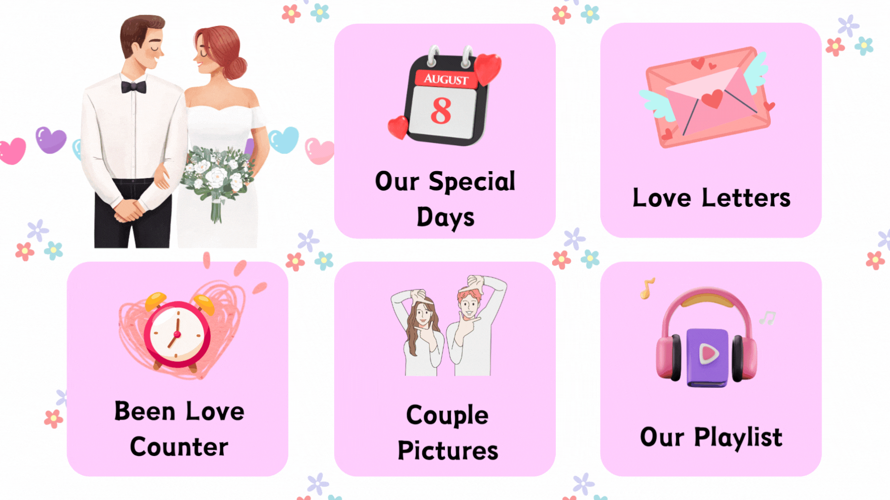

# Anniversary Website

## Overview

This is the source code repository for the Anniversary Website. The website is designed to celebrate special occasions and includes various pages for a delightful experience.

## Pages

1. **Home:** The main landing page with a welcome message.
2. **Playlist:** A page featuring a curated playlist with love songs.
3. **Poem:** A page dedicated to a special love poem.
4. **Gallery:** A collection of memorable photos and moments.
5. **Video Messages:** Personalized video messages from loved ones.

## Accessibility

The Anniversary Website is designed with accessibility in mind to ensure a positive experience for all users. Key accessibility features include:

- **Responsive Design:** The website adapts to different screen sizes, ensuring a seamless experience on various devices.
- **Keyboard Navigation:** Users can navigate through the site using keyboard controls.
- **Alt Text for Images:** All images include descriptive alt text for users with visual impairments.
- **Color Contrast:** High contrast is maintained for text and background colors to improve readability.

Feel free to explore the repository and use the code for your own special occasions!

